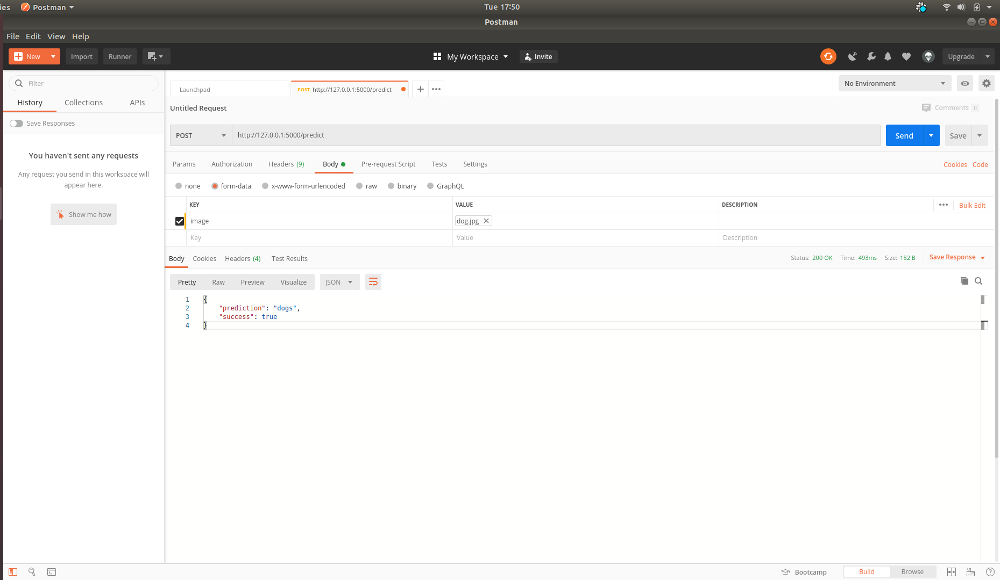

# Contributing to CV AppStore Model Card (Classification)
## Requirements
You would need to package your model, source codes and weights, into a docker container, and expose a POST endpoint `/predict`<br>

Your `/predict` endpoint should include the neccessary pre-processing of the image and output the prediction in a json manner. Example:
```
{
    "success": true,
    "prediction": "dogs"
}
```

For object classification, the `/predict` endpoint should be in the following format:
```
// note that dimensions for bbox are based on the original image dimension
{
  "success": true,
  "detections": [
    {
      "bbox": [left, top, width, height],
      "class": "person",
      "score": 0.83246121
    },
    {
      "bbox": [left, top, width, height],
      "class": "cat",
      "score": 0.73446121
    }
  ]
}
```

### Tutorials
- [Docker tutorial](https://towardsdatascience.com/docker-made-easy-for-data-scientists-b32efbc23165)
- [Flask tutorial](https://towardsdatascience.com/how-to-easily-deploy-machine-learning-models-using-flask-b95af8fe34d4)

## Example
In this template, we would be showing how to do the above with a model trained using the [cifar-10 dataset](https://en.wikipedia.org/wiki/CIFAR-10). Say we have trained a [Simplenet](https://arxiv.org/abs/1608.06037) and want to contribute this model to CV AppStore.

Lets begin by git clon-ing this project
```
git clone https://github.com/zhuoyang125/simple_classifier.git -b cv_app_store
```
### Project Structure
For this example, we structure the project as such.
```
.
├── Dockerfile
├── README.md
├── run_docker.sh # script to run docker container
└── src
    ├── app.py # flask server
    ├── cifar10.json # cifar10 class dictionary
    ├── classifier.py # classifier
    └── SimpleNet-29-0.41.hdf5 # weights of the trained classifier
```

You would need to change the weights and class dictionary to your model. Similarly, edit the `Dockerfile` to your model envrionment.

### Testing your flask server
Once done, you can edit the `run_docker.sh` to call your docker image. You can use [Postman](https://www.postman.com/) to test your endpoints.



### Push to DockerHub
Once done, upload your docker image to docker hub

```
docker login
docker push docker_hub_user/imagename:tagname
```

### Future improvement
We intend to make the template simpler and some scripts to help user create the docker container. For example, the template could just be a `classifier.py` and the user willl create a class that extends from it. We would still need the user code environment though.

We intend to improve as time goes along, so you feedback is important!
